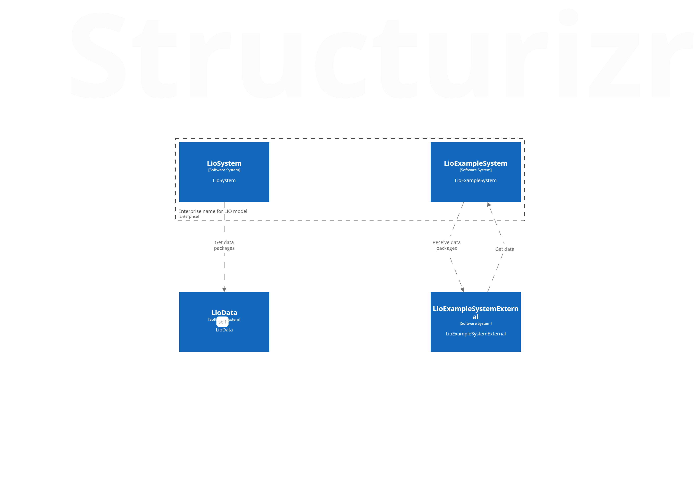

## G1 Backend Services - System Context Level 1

```c#
Birdeye on G1 backend system on ssytem context level. 
```

Explore high dependencies with another software systems like BI or LioData. 
Give it a try -> just keep exploring and you'll be inlighted by Lio architecture made gathered.

Enjoy!

#### References

* [Glossry](02-glossary.md)
* [About Structurizr and how it compares to other tooling](https://structurizr.com/help/about)
* [Basic concepts](https://structurizr.com/help/concepts) (workspaces, models, views and documentation)
* [C4 model](https://structurizr.com/help/c4)

[](https://travis-ci.org/jreese/markdown-pp)

<!--  -->


